# Radicle Visual Identity Guideline

Radicle is a language, a peer-to-peer stack, and a collaboration tool. Reflecting its multi-layered nature, Radicle’s visual identity is conceived to be additive, and existing in multiple layers. This document outlines the brand’s Core Elements, the most fundamental layer of the visual identity, representing the rigid logical structures that are foundational to Radicle. The guideline is planned to be updated and expanded to add new layers of visual vocabulary as the product matures, to adequately represent the more procedural and organic nature of the brand.

# Core Elements

## Logotype

The logotype is constructed with a custom drawing of letters largely based on the typeface that is currently under development, [The Future Mono](https://www.futurefonts.xyz/klim/the-future-mono), designed by [Klim Type Foundry](https://klim.co.nz/), drawing inspirations from Paul Renner’s [early sketches for Futura](https://books.google.com/books?id=zfT0Iam0q7AC&lpg=PA90&ots=RsiZZzSmmn&dq=Paul%20Renner%E2%80%99s%20early%20sketch%20futura&pg=PA87#v=onepage&q&f=false). Even though the letterforms exhibit qualities of a mono-spaced font, please note the Radicle Logotype is proportionally spaced by default.

[**Download radicle-logotype.ai for the raw file**](assets/radicle-logotype.ai)
[**Download radicle-logotype.svg to use internally & externally**](assets/radicle-logotype.svg)

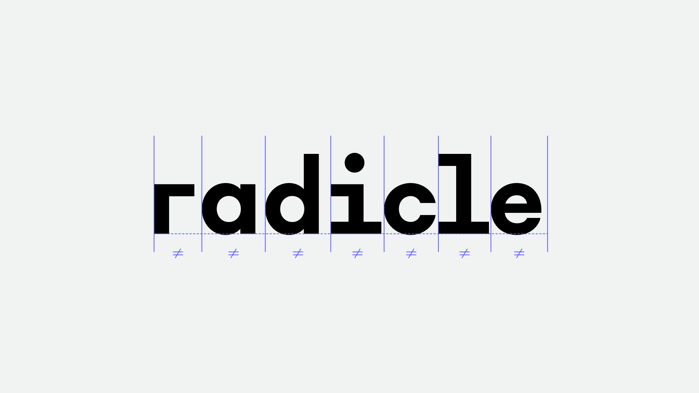
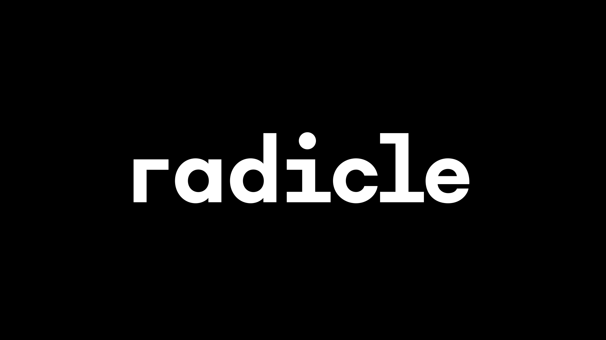

### Software Version Identifier
Software Version Identifier takes the form of a superscript. The ratio between the logotype and the identifier can be flexible, especially when the logotype s displayed in small size.

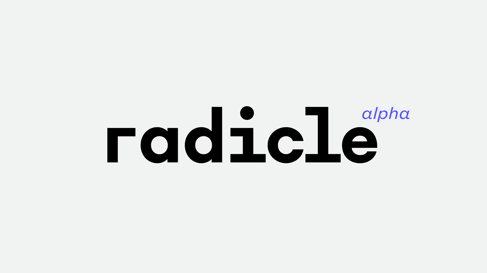

### Radicle.xyz
The special lockup of the [radicle.xyz](http://radicle.xyz) domain name is provided as it is considered as an important part of the brand.

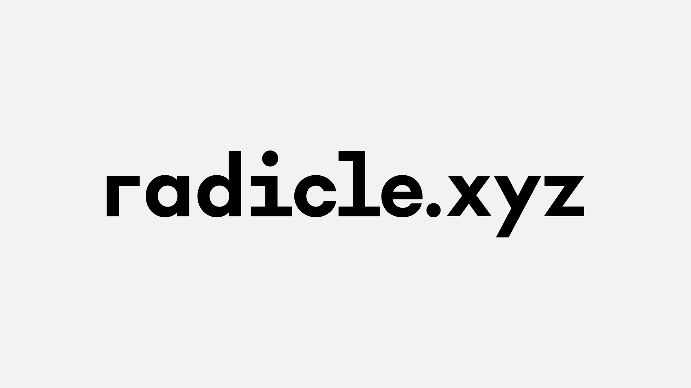

### Mono-spaced Variant
To reflect the computational and mathematical nature of the brand, Radicle Visual Identity includes a special, mono-spaced variation of the logotype. This version can only be use when the letters or words are repeated to form a visual pattern.

[**Download radicle-logotype-monospaced.ai**](assets/radicle-logotype-monospaced.ai)

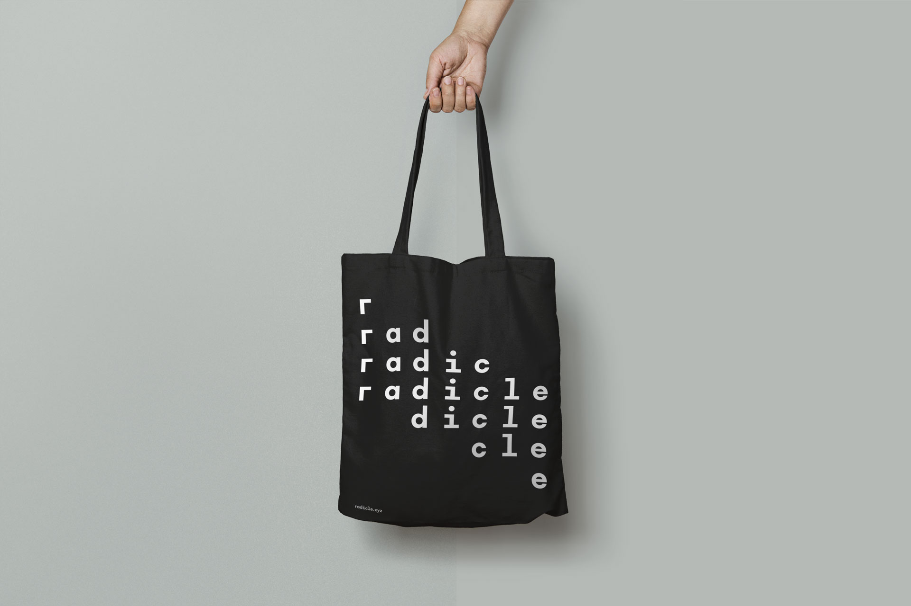
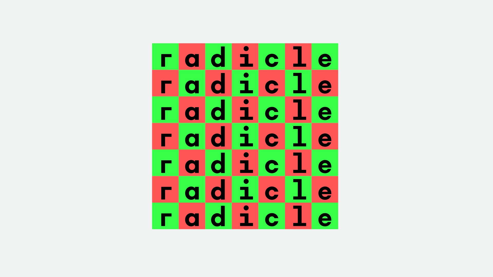
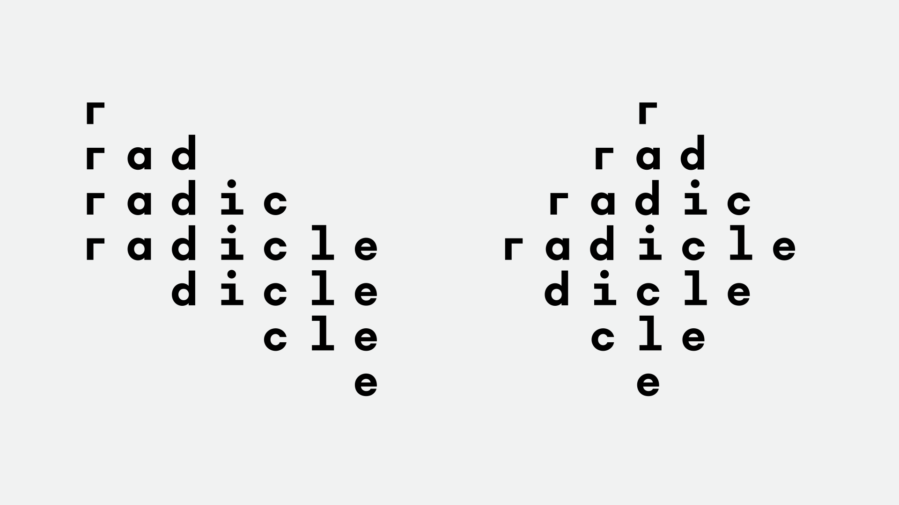

## Color Palette
The Radicle colors are inspired by the original 16 colors available for [Color Graphics Adapter (CGA)](https://en.wikipedia.org/wiki/Color_Graphics_Adapter), one of the earliest popular color display systems. The original color palette consists of six vivid colors offered in two shades, along with four shades of gray including black and white. The Radicle Color Palette uses smaller set, only consisting of six bright vivid colors, black and white.

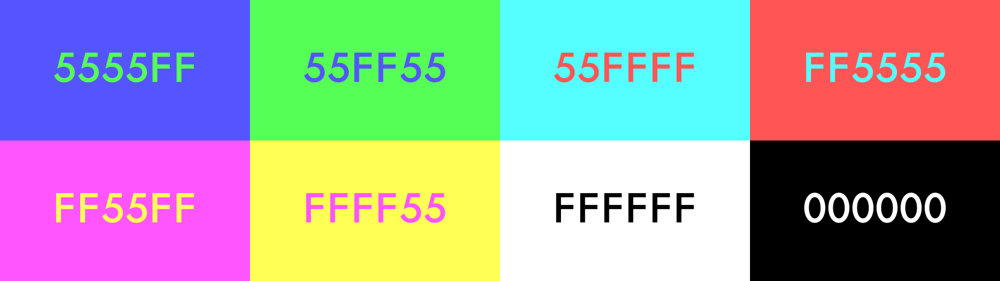

| Name            | Hex     | RGB                |
| --------------- | ------- | ------------------ |
| Radicle Blue    | #5555FF | RGB(85, 85, 255)   |
| Radicle Green   | #55FF55 | RGB(85, 255, 85)   |
| Radicle Cyan    | #55FFFF | RGB(85, 255, 255)  |
| Radicle Red     | #FF5555 | RGB(255, 85, 85)   |
| Radicle Magenta | #FF55FF | RGB(255, 85, 255)  |
| Radicle Yellow  | #FFFF55 | RGB(255, 255, 85)  |
| Radicle White   | #FFFFFF | RGB(255, 255, 255) |
| Radicle Black   | #000000 | RGB(0, 0, 0)       |

### Selective Usage
Similar to the [CGA’s output capabilities](https://en.wikipedia.org/wiki/Color_Graphics_Adapter#Output_capabilities), Radicle strongly encourages using only four colors form the palette at any given moment.

## Typeface
The Radicle brand relies heavily on the use of type on its applications. There are two display typefaces, The Future Mono and Vulf Mono Light Italic creating stark contrast. The body type can be set in Founders Grotesk Text which has a mono-spaced companion for code display.

### Display Type: The Future Mono
The Future Mono is designed by [Klim Type Foundry](https://klim.co.nz/), and currently under development. Its license can be obtained from [here](https://www.futurefonts.xyz/klim/the-future-mono) and the type specimen can be found [here](https://incremental-production.s3-us-west-2.amazonaws.com/uploads/typeface_version/specimen/147/The-Future-Mono-01_2018-10-16.pdf).

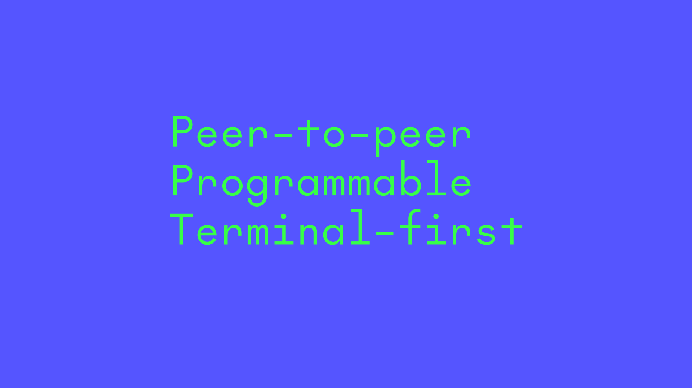

### Display Type: Vulf Mono Light Italic
Vulf Mono family is designed by [OH no Type Company](https://ohnotype.co/). Its license can be obtained from [here](https://ohnotype.co/fonts/vulf-mono) and the type specimen can be found [here](https://ohnotype.co/specimens/vulf_mono_specimen.pdf). Please note Radicle only use the ‘Light Italic’ cut of the typeface and nothing else.

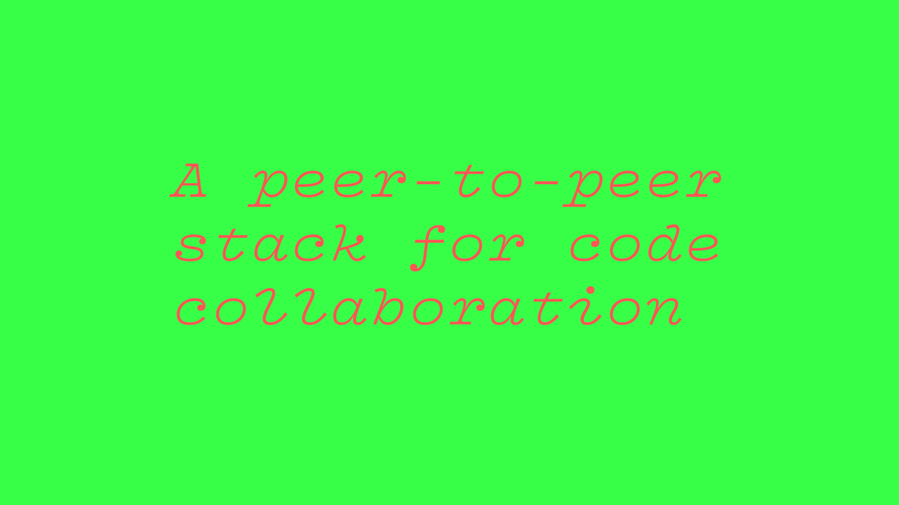

### Text: Founders Grotesk Text
Founders Grotesk Text is designed by [Klim Type Foundry](https://klim.co.nz/). Its license can be obtained from [here](https://klim.co.nz/retail-fonts/founders-grotesk-text/) and the type specimen can be found [here](https://d8dqtvdh2kbkr.cloudfront.net/media/documents/founders-grotesk-text_specimen.pdf).

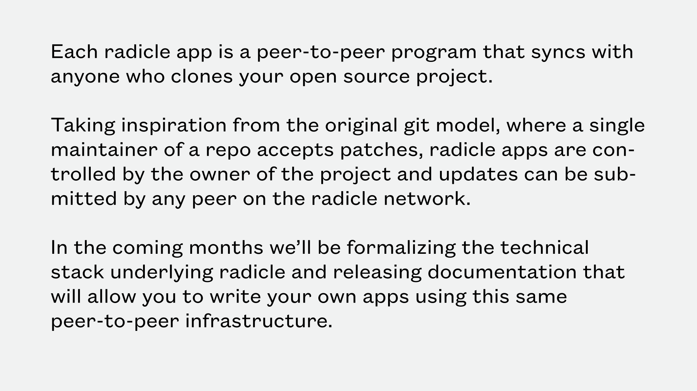

### Code: Founders Grotesk Mono
Founders Grotesk Mono is designed by [Klim Type Foundry](https://klim.co.nz/). Its license can be obtained from [here](https://klim.co.nz/retail-fonts/founders-grotesk-mono/) and the type specimen can be found [here](https://d8dqtvdh2kbkr.cloudfront.net/media/documents/founders-grotesk-mono_specimen.pdf).

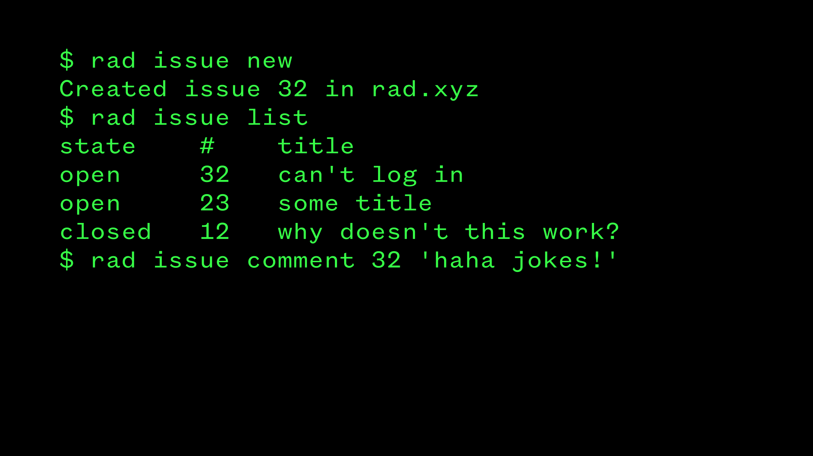

# Procedural Elements

WIP

# Assemblage

WIP
