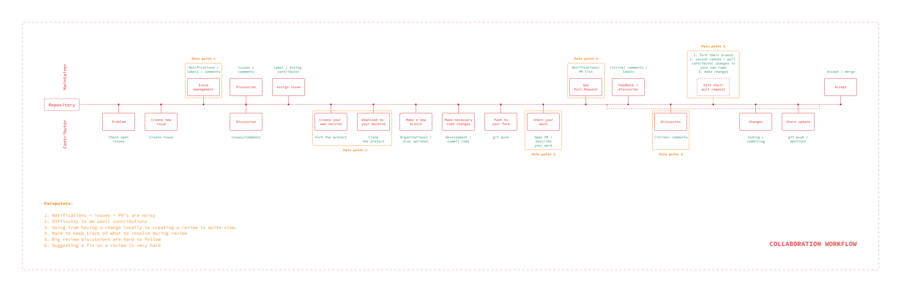
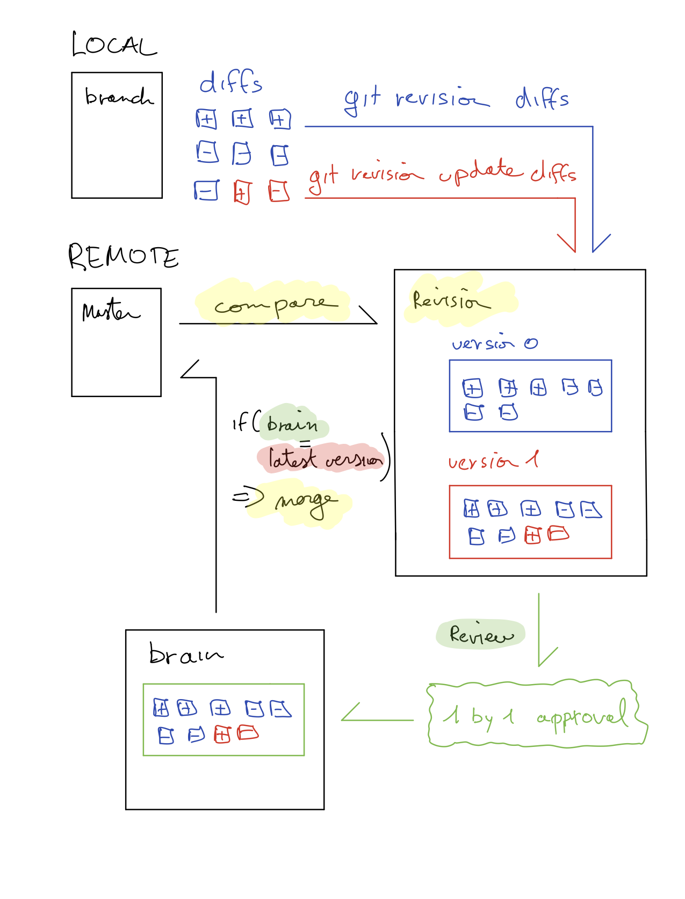

# Collaboration Flow

## Research

Find the process and research [here](../../../research/code-collaboration-research/collaboration-flow-research.md)

## Principles

1.  Backwards compatible (users can keep their existing workflow)
1.  Workflow accessible entirely through the CLI
1.  Enable more flexibility in contributions (more then just branch based)
1.  Enable people to contribute without being git experts

## Existing flow

[Detailed view here](https://www.figma.com/file/Y8jV3trSKHcUpIzfj9F3Z2Mi/Collaboration-Workflow?node-id=113%3A0)

### Existing pain points

1.  Notifications + issues + PR's
    - Lots of noise
    - Doesn't indicate how much work needs to be put into any of it
    - Hard to get an overview and easy to get overwhelmed
2.  Difficulty to do small contributions
    - Current workflow forces you to always make branches/PR's
    - Sometimes you just want to do a small patch
3.  Going from having a change locally to creating a PR is quite slow.
    - Ideally the process is seamless and my changes show up as suggestions/contributions (no separate PR flow needed)
    - PR is good for "official" proposals
4.  Hard to keep track of what to resolve during Review
    - On GH combination of "notifications and PR tab"
    - Nice to not have to context switch too much > resolve these inline as much as possible
5.  Big PR discussions are hard to follow
    - Threaded comments could help
6.  Suggesting a fix on a review is very hard
    - Would be great to be able to do light weight contributions without having to make a pr on a pr

## Our approach

A **revision** based approach that is not tied to always reviewing branches but supports that workflow if needed. We allow for light to heavy weight revisions to always make contributing code from a small typo fix to a whole new feature as easy as possible. Revisions are structured as a todo list, clearly indicating the diffs the reviewer has seen and the ones that are still open.

To make reviewing easier we have **suggestions** on revisions. Suggestions are small code changes that are lightweight and can only be accepted or rejected, enabling reviewers to contribute small fixes without having to create a new branch/PR on top of the revision or trying to explain code in comments.

Reviewers can easily get the code on their machine thanks to "**workspaces**". Based on git worktrees, they allow us to easily get a version of the codebase that you're reviewing on your machine without interrupting your current work. You can just switch your environment from what you're working on to the code that you're reviewing without having to commit or stash.

This new workflow will be powered by an **inbox** type dashboard. This overview will give you insight into what state all your work is in and what needs your attention and then quickly jump into reviewing when and where you need to.

This whole experience should be available from both the web UI as well as be integrated into your editors. Aiming to have as little context switching as possible for the contributors.

### 1. Inbox

Todo list approach: Gives you an overview of anything that is related to you or needs your attention and allows you to jump into the revisions and from there easily open the revision up in your editor and contribute more than just comments. We do that by creating work trees for a revision.

#### Overview

- Revisions
  - revisions you're involved in
    - Is reviewed/needs changes/rejected
    - Has new comments
    - Has replies to your comments
    - Has suggestions/proposals to your code
      - Is accepted
      - Is rejected
      - Has comments
  - revisions you own
    - Is reviewed/needs changes/rejected
    - Has new comments
    - Has replies to your comments
    - Has suggestions/proposals to your code
      - Is accepted
      - Is rejected
      - Has comments
- Issues
  - Issues you're involved in
    - Has new comments
    - New replies
    - New revision
  - Issues you own
    - Has new comments
    - New replies
    - New revision
- Unclean workspaces
  - With uncommitted changes
  - With unmerged branches
  - Basically any work in progress

### 2. Revisions

Revisions are like a Pull Request, except they can be started from anything. One or a set of commits, a branch(, an issue?) etc. They represent the central place where reviewers & contributors can get a quick overview, follow and partake in the conversation and easily suggest small fixes or patches.

#### Opening a revision

It's as easy as making some changes on your local copy. When you feel you have something you'd like to contribute, you can just create a revision of that set of work. You give it a description (or use your commit message), define the reviewers that need to be part of it, etc and submit it.

If the changes are very small or contained, you get the option to open a lightweight review. Those are very easy and quick to open as well as to review and merge, eg. a few lines of text change in the README.md

If you happen to build on top of your current revision or do some change to it, you can easily push an update to that revision. That will then notify the reviewers that new changes have been added.

#### Reviewing a revision

In your inbox you'll see that there is a new revision that mentions you as a reviewer. You can simply click on the revision to see an overview of the files you need to review.

As you go through a file a set of diffs is presented to you, you approve all the diffs and the file will be shown as "reviewed". You need to go through each diff and approve them one by one. If you don't approve them you have the option of adding a comment or making a suggestion. Only when the set of diffs have all been approved by you, will you be able to mark the revision as reviewed. Would the author update the revision while you're reviewing it. It will only ask you to review the diffs have changed or new ones that were created, so that you never have to review the same diff twice.

#### Adding a suggestion

During a revision, if you happen to see a small bug or typo or just want to suggest a different way to do it. You'll be able to easily pull this revision to your local environment (with workspaces) and run it. You can change the code that you want to change and then just "suggest" this change to the revision.

#### Dealing with a suggestion

The author of the revision will see in their inbox that their revision has a new suggestion. They can just go there and check out the suggestion. A suggestion is lightweight and shouldn't need any explanation. As the author you have 3 choices:

1.  Accept it and it gets added to your staging
1.  Reject it and the person suggesting will get notified
1.  Comment on it and the person suggesting will get notified

#### Merging a revision

Once all the reviewees have approved the revision, it shows up in your inbox as "Approved" and you can then merge the revision into whatever branch it needs to be merged into.

**You can see what the commands and workflow would look like [here](https://gist.github.com/cloudhead/5a28df757de37252546f99fe39e6cc55)**

#### Reviewing diffs The brain

- Todo list of diffs to review organized by file
- You accept each diff one by one to complete a review
- Once a diff is accepted, you never need to review it again
- You can comment and have discussion around the diffs
- Only if the approved diffs in the brain match the reviews' diffs, can the reviewer accept the revision.

### 3. Workspaces

Workspaces allows one to explore anybody else's code without interrupting our current work. You can open a workspace from a repo, a branch, a revision and a suggestion. It provides a local version where we can explore the code and run it as well, enabling us to understand other people's work better. We hope that having the code that you're reviewing so accessible it could actually reduce complicated conversations about a revision and nudge contributors and reviewers to jump in and fix the code themselves.

---

# Reviews & Feedback

## Meeting notes demo

_130818 with Kim, Julian, Onur and James_

- Concept of linking issues and revisions
  - Could a issue be a revision with no reviewers and no code contributions?
  - Who would own the revision?
  - What if you solve multiple issues with one revision?
- Some answered and closed issues are basically the documentation, could there be a way to "close and add to readme" kind of functionality?
- The fact that suggestions need to be approved by the owner of the revision might actually slow the review process down, if a maintainer suggests something on a Revision they are supposed to accept and merge, should they really be blocked by a suggestion
  - Today, you would accept the PR and add a commit on top
- We could still allow for inline comments but just through editor integrations
-

## Meeting notes review

_270818 with Alexis_

- Rename version to just be the range of commits
  - Master … Fa2b4d
  - Fa2b4d … jflks79f
- 3 tabs:
  - For viewer: files changed
  - For reviewer: Review
  - For author: suggestions and comments
- Grey section in versions:
  - How much there is todo
- In tabs: Review (**15**)
- Inline comments
  - Make smaller/less intrusive then github
    - Collapsed like slack
    - On the side like google docs
- Review staging
  - When reviewer is in review tab and starts to approve "hunks" those get added to a review staging area on top of page
  - Shows you how many you've approved/rejected/commented/ etc

## Meeting notes review

_180918 with Alexis, Tomas, Thomas, Julian & Kim_

For context: We went through [my design file, ](https://www.figma.com/file/X6vifdQjwkomEHATMJDNHxUU/app?node-id=102%3A0)I showed my current thinking around the revision timeline, the reviewers' review tab, revision authors' inbox, splitting of hunks + behaviour, inline comments, threaded comments, resolving discussion + behaviour. I understand this might be a bit abstract, but ping me if you want more info.

Feedback from today's session:

- Wording updated "test" = "checks"
- does resolving discussion on a hunk also automatically accept the hunk?
- When a reviewer splits a hunk:
  - Author gets notified
  - other reviewers:
    - if joined hunk was already accepted, split hunks are also accepted
    - if joined hunk was not accepted, you'll have to accept both hunks individually
- In review tab:
  - have a comment box that is at the same level as the to be accepted hunks. This comment box serves as a notepad where you can keep general feedback that you can submit together with your accepted hunks and opened discussions
  - show unresolved discussion of previous revisions versions inline if possible, if they are outdated show them in a seperate section so you can keep the context when reviewing the newer version.
  - option to sorting hunks by file or by commit?

As for next steps, I will take a look at all the feedback digested below and sync back with you next week. I'm thinking of having a weekly or 2 weekly design review where I can get more feedback and keep you all more in the loop.

## Meeting notes review

_181002 with Ange, Alexis, Tomas, Thomas, Julian, Kim, James & Sam_

For context: We went through [my design file](https://www.figma.com/file/X6vifdQjwkomEHATMJDNHxUU/app?node-id=102%3A0). This week I focussed on the repo page and source navigation, unresolved discussion on updated hunks, unresolved discussion in general, timeline and versions.

Some points that I'm gonna work around:

- markdown todos in review box are linked to revision-authors' ability to resolve that discussion
- every comment is a discussion except global revision comments
- every comment needs to stay in timeline, collapsed if resolved, but still there for reference
- types of hunks in review tab:
  - unaccepted hunks
  - unresolved discussion on unaccepted hunks
  - unresolved discussion on outdated hunks (because of new version)
    - new hunk
    - no more hunk
- resolve discussion vs close discussion (same as "will not solve")
- Repo overview:
  - source is interesting for browsing a code base
  - for everybody having just the latest issue and most recent revision should be enough
    - for maintainers or contributors seeing more issues and PR's might be nice
  - maybe we can show the readme above the source but a expandable version like in github mobile.
- When reviewing:
  - it would be good to see all unresolved discussion on older versions of the hunks as well
  - see all unresolved or not closed discussions for reference
- Timeline:
  - maybe versions are on hunks not on timeline, you can see the whole history with collapsed parts that are resolved
  - or leave versions open with unresolved discussions
